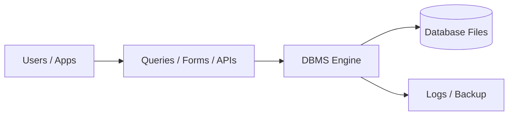
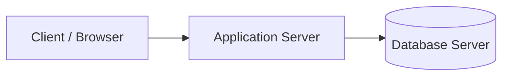
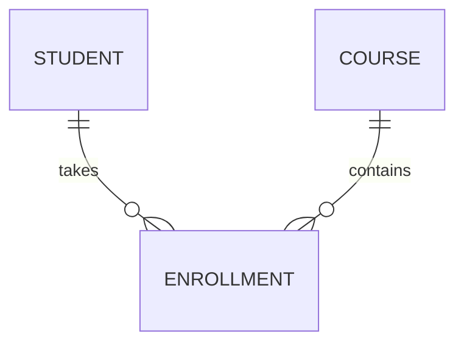
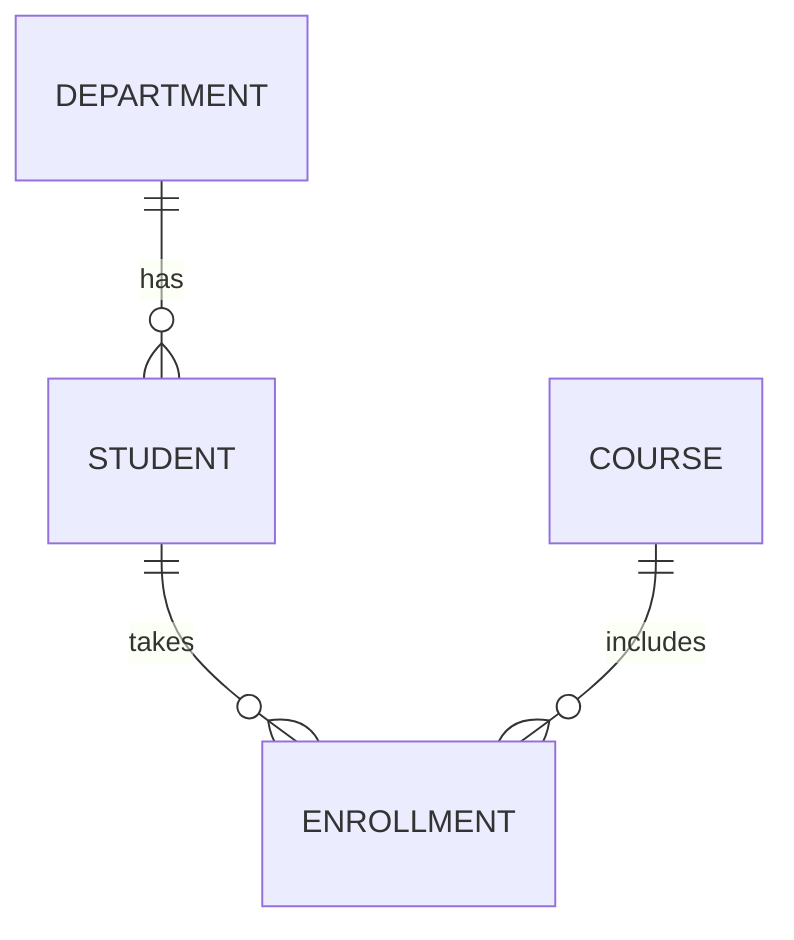
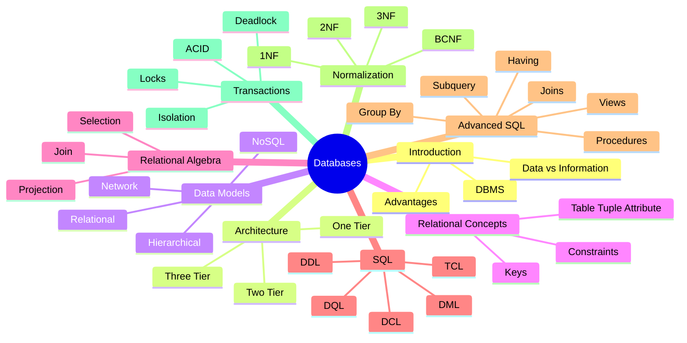
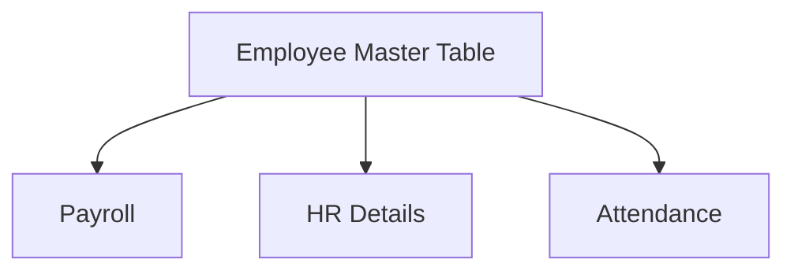

# Databases Complete Master Notes (MCQ + Theory + Examples)

This file is a full, detailed set of notes for **Databases** based on your text.
It includes:
- Complete outline first
- Every topic and subtopic explained in depth
- Tables, diagrams, mini case studies, and examples
- MCQ-focused points (common traps and memory shortcuts)

---

## Complete Outline

1. Introduction to Database Systems
2. Database System Architecture
3. Data Models
4. Relational Database Concepts
5. Relational Algebra and Relational Calculus
6. SQL (Structured Query Language)
7. Advanced SQL
8. Database Design and Normalization
9. Transaction Management

---

## 1) Introduction to Database Systems

### 1.1 What is a Database?

A **database** is an organized collection of data stored electronically so that it can be:
- Saved efficiently
- Retrieved quickly
- Updated safely
- Shared among multiple users/applications

#### Real-World Example

If a university stores student records in notebooks, searching one student may take hours.
If stored in a database, the same student can be found in milliseconds.

### 1.2 What is DBMS?

**DBMS (Database Management System)** is software that manages databases.
Examples:
- MySQL
- PostgreSQL
- Oracle
- SQL Server
- SQLite

| Component | Role |
|---|---|
| Database | Stores actual data |
| DBMS | Manages storage, retrieval, security, integrity |
| Users | Interact through queries, forms, apps |

### 1.3 Data vs Information

| Term | Meaning | Example |
|---|---|---|
| Data | Raw facts | `101`, `Ali`, `92` |
| Information | Processed/organized data with meaning | "Ali (Roll 101) scored 92 in DBMS" |

### 1.4 Why We Need Databases

Without DBMS, files cause:
- Duplicate data
- Inconsistency
- Hard sharing
- Weak security
- Difficult backup

With DBMS, benefits include:

| Benefit | Explanation |
|---|---|
| Reduced Redundancy | Same data stored once, reused via relations |
| Integrity | Constraints keep data valid |
| Security | Login, roles, permissions |
| Concurrency | Multiple users access simultaneously |
| Backup and Recovery | Data can be restored after crashes |
| Data Independence | App changes do not always require data format changes |

### 1.5 File System vs DBMS

| Feature | File System | DBMS |
|---|---|---|
| Redundancy | High | Low |
| Security | Basic | Advanced |
| Querying | Difficult/manual | SQL-based, flexible |
| Concurrency | Weak | Strong |
| Recovery | Manual | Built-in mechanisms |

### 1.6 Mini Diagram: Database Ecosystem



### 1.7 MCQ Traps (Important)

- DBMS is software, database is data collection.
- Data independence is a DBMS feature.
- Integrity is maintained by constraints and rules.

---

## 2) Database System Architecture

Architecture describes how client, application logic, and database are arranged.

### 2.1 1-Tier Architecture

User directly interacts with database on same machine.

| Aspect | Details |
|---|---|
| Layers | User + DB on one system |
| Use | Local development, testing |
| Pros | Simple setup |
| Cons | Not scalable, weak security |

```text
[User+App+DB] (single machine)
```

### 2.2 2-Tier Architecture (Client-Server)

Client application talks directly to DB server.

| Aspect | Details |
|---|---|
| Layers | Client, Database Server |
| Use | Small business LAN apps |
| Pros | Better than 1-tier |
| Cons | Business logic on client, hard maintenance |

```text
[Client App] <----SQL----> [Database Server]
```

### 2.3 3-Tier Architecture (Most Used in Web Apps)

Client -> Application Server -> Database Server

| Layer | Responsibility |
|---|---|
| Presentation | UI (browser/mobile) |
| Application (Business Logic) | Validation, rules, APIs |
| Data Layer | Persistent storage |



### 2.4 Why 3-Tier is Preferred

- Better security: DB hidden from direct client access
- Better scalability: app tier can be replicated
- Better maintainability: logic centralized

### 2.5 Distributed and Cloud DB Architectures (Extended Understanding)

| Type | Idea |
|---|---|
| Distributed DB | Data split/replicated across multiple servers |
| Cloud Managed DB | DB as service (AWS RDS, Azure SQL) |
| Sharded DB | Large table split by key ranges |
| Replicated DB | Copies maintained for reliability and reads |

### 2.6 Architecture Comparison Table

| Criteria | 1-Tier | 2-Tier | 3-Tier |
|---|---|---|---|
| Security | Low | Medium | High |
| Scalability | Low | Medium | High |
| Maintenance | Easy (small) | Medium | Best for large systems |
| Use Case | Practice | Departmental apps | Enterprise/web/mobile |

---

## 3) Data Models

A data model defines how data is structured, linked, and constrained.

### 3.1 Hierarchical Model

Tree structure (parent-child), one parent can have many children.

| Feature | Description |
|---|---|
| Structure | Tree |
| Relationship | One-to-many |
| Limitation | Child has only one parent |

```text
Company
 ├── HR
 │   ├── Emp1
 │   └── Emp2
 └── IT
         ├── Emp3
         └── Emp4
```

### 3.2 Network Model

Graph-like model. A record can have multiple parent records.

| Feature | Description |
|---|---|
| Structure | Graph |
| Relationship | Many-to-many possible |
| Complexity | More complex than hierarchical |

### 3.3 Relational Model (Most Important)

Data stored in tables (relations).

| Concept | Example |
|---|---|
| Relation | `Students` table |
| Tuple | One row/student |
| Attribute | Column like `name`, `age` |

Why most popular:
- Simple tabular format
- Strong theory (algebra, normalization)
- Powerful query language (SQL)

### 3.4 NoSQL Models

Used for large-scale, flexible, or unstructured data.

| NoSQL Type | Structure | Example Use |
|---|---|---|
| Key-Value | `key -> value` | Caching, sessions |
| Document | JSON-like docs | Product catalogs, content apps |
| Column-Family | Wide columns | Analytics, logs |
| Graph | Nodes + edges | Social networks, recommendations |

### 3.5 SQL vs NoSQL Quick View

| Factor | SQL (Relational) | NoSQL |
|---|---|---|
| Schema | Fixed | Flexible |
| Joins | Strong support | Limited/varies |
| Consistency | Strong | Can be eventual |
| Scale style | Vertical + some horizontal | Horizontal friendly |

### 3.6 Model Selection Example

| Scenario | Best Fit |
|---|---|
| Banking transactions | Relational |
| Real-time cache | Key-Value |
| Social graph | Graph |
| IoT high-volume logs | Column-family/document |

---

## 4) Relational Database Concepts

### 4.1 Core Terms

| Term | Meaning |
|---|---|
| Relation | Table |
| Tuple | Row |
| Attribute | Column |
| Domain | Allowed set/type of values |
| Cardinality | Number of rows |
| Degree | Number of columns |

### 4.2 Example Table

| StudentID | Name | Department | Age |
|---|---|---|---|
| 101 | Awais | CS | 21 |
| 102 | Sara | SE | 22 |

Here:
- Cardinality = 2
- Degree = 4

### 4.3 Keys (Very Important)

#### Primary Key (PK)
Uniquely identifies each row. Cannot be NULL.

#### Foreign Key (FK)
A column in one table that references PK in another table.

#### Candidate Key
Any column/set that can uniquely identify rows.

#### Alternate Key
Candidate key not chosen as primary key.

#### Composite Key
Key made by combining two or more columns.

#### Super Key
Any set of attributes that uniquely identifies rows.

### 4.4 Key Example

`Students(StudentID, CNIC, Email, Name)`

- Candidate keys: `StudentID`, `CNIC`, `Email`
- If `StudentID` chosen as PK, then `CNIC` and `Email` are alternate keys.

### 4.5 Integrity Constraints

| Constraint | Rule |
|---|---|
| Entity Integrity | PK must be unique and not null |
| Referential Integrity | FK value must exist in parent table (or be null, depending rule) |
| Domain Integrity | Value must be in allowed domain/type/range |
| Key Constraint | No duplicate key values |

### 4.6 Relationship Types

| Type | Example |
|---|---|
| One-to-One | Person -> Passport |
| One-to-Many | Department -> Employees |
| Many-to-Many | Students <-> Courses |

Many-to-many is implemented via a junction table.



### 4.7 Null Values

`NULL` means value is missing/unknown/not applicable.
It is not zero and not empty string.

### 4.8 Schema vs Instance

| Term | Meaning |
|---|---|
| Schema | Table design/structure |
| Instance | Data currently stored at a moment |

---

## 5) Relational Algebra and Relational Calculus

Relational algebra is procedural (how to query).
Relational calculus is non-procedural (what to query).

### 5.1 Fundamental Relational Algebra Operations

| Operation | Symbol | Meaning |
|---|---|---|
| Selection | $\sigma$ | Select rows by condition |
| Projection | $\pi$ | Select columns |
| Union | $\cup$ | Combine tuples from two relations |
| Set Difference | $-$ | Tuples in A not in B |
| Cartesian Product | $\times$ | All pair combinations |
| Rename | $\rho$ | Rename relation/attributes |

### 5.2 Derived Operations

| Operation | Symbol | Meaning |
|---|---|---|
| Intersection | $\cap$ | Common tuples |
| Join | $\bowtie$ | Combine related tuples |
| Division | $\div$ | "For all" style queries |

### 5.3 Selection Example

Relation `Student(StudentID, Name, Dept, Age)`

Find CS students:

$$
\sigma_{Dept='CS'}(Student)
$$

### 5.4 Projection Example

Find names only:

$$
\pi_{Name}(Student)
$$

### 5.5 Join Example

`Student(StudentID, Name, DeptID)`
`Department(DeptID, DeptName)`

$$
Student \bowtie_{Student.DeptID = Department.DeptID} Department
$$

### 5.6 Types of Join (Conceptual)

| Join Type | Result |
|---|---|
| Inner Join | Matching rows only |
| Left Outer Join | All left rows + matched right |
| Right Outer Join | All right rows + matched left |
| Full Outer Join | All rows from both sides |
| Self Join | Table joined with itself |

### 5.7 Relational Calculus

#### Tuple Relational Calculus (TRC)
Uses tuple variables.

Example style:
`{ t.Name | Student(t) AND t.Dept='CS' }`

#### Domain Relational Calculus (DRC)
Uses domain variables (column values).

### 5.8 Algebra vs SQL Mapping

| Relational Algebra | SQL Equivalent |
|---|---|
| $\sigma$ | `WHERE` |
| $\pi$ | `SELECT col1,col2` |
| $\bowtie$ | `JOIN ... ON ...` |
| $\cup$ | `UNION` |

---

## 6) SQL (Structured Query Language)

SQL categories are essential for exams.

### 6.1 SQL Command Categories

| Category | Full Form | Commands |
|---|---|---|
| DDL | Data Definition Language | `CREATE`, `ALTER`, `DROP`, `TRUNCATE` |
| DML | Data Manipulation Language | `INSERT`, `UPDATE`, `DELETE` |
| DQL | Data Query Language | `SELECT` |
| DCL | Data Control Language | `GRANT`, `REVOKE` |
| TCL | Transaction Control Language | `COMMIT`, `ROLLBACK`, `SAVEPOINT` |

### 6.2 DDL with Examples

```sql
CREATE TABLE Department (
    DeptID INT PRIMARY KEY,
    DeptName VARCHAR(100) NOT NULL UNIQUE
);

CREATE TABLE Student (
    StudentID INT PRIMARY KEY,
    Name VARCHAR(100) NOT NULL,
    Age INT CHECK (Age >= 16),
    DeptID INT,
    FOREIGN KEY (DeptID) REFERENCES Department(DeptID)
);
```

```sql
ALTER TABLE Student ADD Email VARCHAR(150) UNIQUE;
```

```sql
DROP TABLE Student;
```

### 6.3 DML with Examples

```sql
INSERT INTO Department (DeptID, DeptName)
VALUES (1, 'Computer Science'), (2, 'Software Engineering');

INSERT INTO Student (StudentID, Name, Age, DeptID, Email)
VALUES (101, 'Awais', 21, 1, 'awais@example.com');
```

```sql
UPDATE Student
SET Age = 22
WHERE StudentID = 101;
```

```sql
DELETE FROM Student
WHERE StudentID = 101;
```

### 6.4 DQL (`SELECT`) Basics

```sql
SELECT * FROM Student;
SELECT Name, Age FROM Student;
SELECT DISTINCT DeptID FROM Student;
SELECT * FROM Student WHERE Age >= 20;
```

### 6.5 Constraints

| Constraint | Purpose |
|---|---|
| `NOT NULL` | Value required |
| `UNIQUE` | No duplicate values |
| `PRIMARY KEY` | Unique + not null identity |
| `FOREIGN KEY` | Enforce table relationship |
| `CHECK` | Validate condition |
| `DEFAULT` | Auto default value |

### 6.6 SQL Clause Execution Order (MCQ Favorite)

Logical order:
1. `FROM`
2. `WHERE`
3. `GROUP BY`
4. `HAVING`
5. `SELECT`
6. `ORDER BY`
7. `LIMIT/OFFSET`

### 6.7 WHERE vs HAVING

| Clause | Works On | Use For |
|---|---|---|
| `WHERE` | Rows before grouping | Normal filters |
| `HAVING` | Groups after aggregation | Filter aggregate results |

---

## 7) Advanced SQL

### 7.1 JOINS in Depth

Tables:
- `Student(StudentID, Name, DeptID)`
- `Department(DeptID, DeptName)`

#### INNER JOIN

```sql
SELECT s.StudentID, s.Name, d.DeptName
FROM Student s
INNER JOIN Department d ON s.DeptID = d.DeptID;
```

Returns only students having valid matching department.

#### LEFT JOIN

```sql
SELECT s.StudentID, s.Name, d.DeptName
FROM Student s
LEFT JOIN Department d ON s.DeptID = d.DeptID;
```

Returns all students even when department is missing.

#### RIGHT JOIN

```sql
SELECT s.StudentID, s.Name, d.DeptName
FROM Student s
RIGHT JOIN Department d ON s.DeptID = d.DeptID;
```

Returns all departments even if no students are assigned.

### 7.2 GROUP BY and Aggregate Functions

Common aggregate functions:
- `COUNT()`
- `SUM()`
- `AVG()`
- `MIN()`
- `MAX()`

```sql
SELECT DeptID, COUNT(*) AS TotalStudents, AVG(Age) AS AvgAge
FROM Student
GROUP BY DeptID;
```

### 7.3 HAVING Example

```sql
SELECT DeptID, COUNT(*) AS TotalStudents
FROM Student
GROUP BY DeptID
HAVING COUNT(*) >= 10;
```

### 7.4 Subqueries

#### Single-Row Subquery

```sql
SELECT Name
FROM Student
WHERE Age > (SELECT AVG(Age) FROM Student);
```

#### Multi-Row Subquery with `IN`

```sql
SELECT Name
FROM Student
WHERE DeptID IN (
    SELECT DeptID
    FROM Department
    WHERE DeptName LIKE '%Computer%'
);
```

#### Correlated Subquery

```sql
SELECT s1.Name, s1.Age
FROM Student s1
WHERE s1.Age > (
    SELECT AVG(s2.Age)
    FROM Student s2
    WHERE s2.DeptID = s1.DeptID
);
```

### 7.5 Views

A view is a virtual table created from query.

```sql
CREATE VIEW CS_Students AS
SELECT StudentID, Name, Age
FROM Student
WHERE DeptID = 1;

SELECT * FROM CS_Students;
```

### 7.6 Stored Procedures (Concept + Example)

Stored procedures are precompiled SQL blocks.

```sql
CREATE PROCEDURE GetStudentsByDept
    @Dept INT
AS
BEGIN
    SELECT StudentID, Name, Age
    FROM Student
    WHERE DeptID = @Dept;
END;
```

Benefits:
- Reusability
- Better performance in some engines
- Security (controlled data access)

### 7.7 Indexes (Important performance concept)

```sql
CREATE INDEX idx_student_dept ON Student(DeptID);
```

| Pros | Cons |
|---|---|
| Faster reads/search | Slower inserts/updates |
| Better filtering/sorting | Extra storage needed |

### 7.8 Trigger (Advanced concept)

A trigger executes automatically on insert/update/delete.

Use cases:
- Audit logs
- Enforce business rules
- Automatic field updates

---

## 8) Database Design and Normalization

Normalization organizes tables to reduce redundancy and anomalies.

### 8.1 Why Normalization?

Prevents:
- Insert anomaly
- Update anomaly
- Delete anomaly

### 8.2 Functional Dependency (FD)

`A -> B` means A determines B.

Example:
- `StudentID -> StudentName`

### 8.3 1NF (First Normal Form)

Rule: Each column should contain atomic (single) values.

#### Non-1NF Example

| StudentID | Name | Phones |
|---|---|---|
| 101 | Awais | 0300-1,0300-2 |

`Phones` has multiple values in one cell.

#### 1NF Conversion

| StudentID | Name | Phone |
|---|---|---|
| 101 | Awais | 0300-1 |
| 101 | Awais | 0300-2 |

### 8.4 2NF (Second Normal Form)

Rule:
- Must be in 1NF
- Remove partial dependency on composite key

#### Example Relation

`Enrollment(StudentID, CourseID, StudentName, CourseName, Marks)`

Composite key is `(StudentID, CourseID)`.

Issues:
- `StudentName` depends only on `StudentID`
- `CourseName` depends only on `CourseID`

So not in 2NF.

#### 2NF Decomposition

- `Student(StudentID, StudentName)`
- `Course(CourseID, CourseName)`
- `Enrollment(StudentID, CourseID, Marks)`

### 8.5 3NF (Third Normal Form)

Rule:
- Must be in 2NF
- Remove transitive dependency (non-key depending on non-key)

#### Example

`Employee(EmpID, EmpName, DeptID, DeptName)`

`EmpID -> DeptID`, and `DeptID -> DeptName`
So `EmpID -> DeptName` transitively.

#### 3NF Decomposition

- `Employee(EmpID, EmpName, DeptID)`
- `Department(DeptID, DeptName)`

### 8.6 BCNF (Extended)

BCNF is stronger than 3NF.
For every FD `X -> Y`, X should be a super key.

### 8.7 Normal Forms Comparison

| Normal Form | Main Rule |
|---|---|
| 1NF | Atomic values, no repeating groups |
| 2NF | No partial dependency |
| 3NF | No transitive dependency |
| BCNF | Every determinant is a super key |

### 8.8 Denormalization (Practical Note)

Sometimes controlled redundancy is added for performance in analytics systems.

### 8.9 ER Diagram Basics

| ER Element | Meaning |
|---|---|
| Entity | Object/table concept |
| Attribute | Property/field |
| Relationship | Connection between entities |
| Cardinality | One-to-one, one-to-many, many-to-many |


### 8.10 Database Design Workflow

1. Gather requirements
2. Identify entities/attributes
3. Build ER model
4. Convert to relational schema
5. Apply normalization
6. Add constraints, indexes
7. Validate with sample data

---

## 9) Transaction Management

A transaction is a sequence of one or more operations treated as one logical unit.

### 9.1 Why Transactions?

Without transaction control, partial updates can corrupt data.

### 9.2 ACID Properties (Core)

| Property | Meaning | Banking Example |
|---|---|---|
| Atomicity | All operations succeed or all fail | Debit and credit both happen or both rollback |
| Consistency | DB moves from one valid state to another | Balance rules remain valid |
| Isolation | Concurrent transactions behave safely | Two users cannot corrupt same account balance |
| Durability | Committed data survives crash | After commit, money transfer is permanent |

### 9.3 Transaction Lifecycle

```text
BEGIN -> READ/WRITE -> (COMMIT) success
                                         -> (ROLLBACK) failure
```

### 9.4 TCL Commands

| Command | Purpose |
|---|---|
| `BEGIN` / `START TRANSACTION` | Start transaction |
| `COMMIT` | Save changes permanently |
| `ROLLBACK` | Undo uncommitted changes |
| `SAVEPOINT` | Partial rollback point |

### 9.5 Example Transfer Transaction

```sql
START TRANSACTION;

UPDATE Account SET Balance = Balance - 500 WHERE AccNo = 1001;
UPDATE Account SET Balance = Balance + 500 WHERE AccNo = 2002;

COMMIT;
```

If second update fails:

```sql
ROLLBACK;
```

### 9.6 Concurrency Problems

| Problem | Explanation |
|---|---|
| Dirty Read | Read uncommitted data |
| Non-repeatable Read | Same row read twice gives different values |
| Phantom Read | Re-running query returns extra/missing rows |
| Lost Update | One update overwrites another silently |

### 9.7 Isolation Levels

| Level | Dirty Read | Non-repeatable | Phantom |
|---|---|---|---|
| Read Uncommitted | Possible | Possible | Possible |
| Read Committed | No | Possible | Possible |
| Repeatable Read | No | No | Possible |
| Serializable | No | No | No |

Higher isolation -> safer but slower in high concurrency.

### 9.8 Locking Concepts

| Lock Type | Meaning |
|---|---|
| Shared Lock | Read allowed, no write by others |
| Exclusive Lock | Write lock, blocks others |
| Intent Locks | Signal future row/page locks |

### 9.9 Deadlock

Deadlock happens when transaction A waits for B and B waits for A.

Prevention/handling:
- Lock ordering
- Timeout
- Deadlock detection + rollback one transaction

---

## Large Integrated Example (All Concepts Together)

### Scenario: University System

Tables:
- `Student`
- `Department`
- `Course`
- `Enrollment`

### Schema (SQL)

```sql
CREATE TABLE Department (
    DeptID INT PRIMARY KEY,
    DeptName VARCHAR(100) NOT NULL UNIQUE
);

CREATE TABLE Student (
    StudentID INT PRIMARY KEY,
    Name VARCHAR(100) NOT NULL,
    Age INT CHECK (Age >= 16),
    DeptID INT,
    FOREIGN KEY (DeptID) REFERENCES Department(DeptID)
);

CREATE TABLE Course (
    CourseID INT PRIMARY KEY,
    Title VARCHAR(120) NOT NULL,
    CreditHours INT CHECK (CreditHours BETWEEN 1 AND 4)
);

CREATE TABLE Enrollment (
    StudentID INT,
    CourseID INT,
    Marks INT CHECK (Marks BETWEEN 0 AND 100),
    PRIMARY KEY (StudentID, CourseID),
    FOREIGN KEY (StudentID) REFERENCES Student(StudentID),
    FOREIGN KEY (CourseID) REFERENCES Course(CourseID)
);
```

### Query Set

Top students:

```sql
SELECT s.StudentID, s.Name, AVG(e.Marks) AS AvgMarks
FROM Student s
JOIN Enrollment e ON s.StudentID = e.StudentID
GROUP BY s.StudentID, s.Name
HAVING AVG(e.Marks) >= 85
ORDER BY AvgMarks DESC;
```

Students not enrolled in any course:

```sql
SELECT s.StudentID, s.Name
FROM Student s
LEFT JOIN Enrollment e ON s.StudentID = e.StudentID
WHERE e.StudentID IS NULL;
```

### Diagram



---

## Exam-Centric Quick Revision Tables

### A) Key Differences

| Pair | Difference |
|---|---|
| Data vs Information | Raw vs meaningful |
| DB vs DBMS | Stored collection vs managing software |
| PK vs FK | Own table identity vs reference to another table |
| WHERE vs HAVING | Row filter vs group filter |
| DELETE vs TRUNCATE vs DROP | Remove rows vs clear all rows fast vs remove table structure |

### B) Normalization Fast Memory

| NF | Memory Trick |
|---|---|
| 1NF | One cell, one value |
| 2NF | Full key dependency |
| 3NF | No non-key dependency chain |

### C) ACID Fast Memory

| Letter | Meaning |
|---|---|
| A | All or nothing |
| C | Correct rules preserved |
| I | Independent execution |
| D | Data stays after commit |

---

## Practice MCQ Style Prompts (with short answers)

1. Which SQL clause is processed before `SELECT` logically?
Answer: `FROM`, `WHERE`, `GROUP BY`, `HAVING`, then `SELECT`.

2. Which normal form removes transitive dependency?
Answer: 3NF.

3. Which key references another table's primary key?
Answer: Foreign key.

4. Is `NULL` equal to zero?
Answer: No.

5. Which architecture is most common for web apps?
Answer: 3-tier architecture.

6. Which ACID property ensures committed data survives crash?
Answer: Durability.

7. Which join returns all rows from left table?
Answer: LEFT JOIN.

8. Which SQL category includes `GRANT` and `REVOKE`?
Answer: DCL.

9. Which operation in relational algebra selects columns?
Answer: Projection ($\pi$).

10. Which anomaly occurs when deleting one record unintentionally removes useful data?
Answer: Delete anomaly.

---

## Final Consolidated Summary

Databases are central to modern software systems. A DBMS provides structured storage, retrieval, security, and reliability. The relational model is dominant due to table-based design and SQL support. Core exam topics include architecture (1-tier/2-tier/3-tier), data models, keys and constraints, relational algebra, SQL categories, advanced querying, normalization (1NF-3NF), and transaction management via ACID.

If you master:
- Keys and relationships
- SQL writing and reading
- Normalization rules
- ACID and concurrency

you can solve both **theory** and **MCQ** sections confidently.

---

## Extra Long Notes Section (Detailed Topic Expansion)

This section adds deeper explanation per topic so that no subpoint is missed in preparation.

### Introduction Deep Notes

- Database evolution started because manual and file-based systems became slow and error-prone.
- In a file system, each department may keep separate files for same person, causing duplication.
- DBMS solved this with centralized controlled storage.
- Modern DBMS supports transactions, indexing, optimization, and permissions.

### Architecture Deep Notes

- 1-tier is educational and not production-grade.
- 2-tier can become heavy on client systems because business logic is spread across clients.
- 3-tier supports APIs, load balancing, and modular development.
- Cloud-native systems often extend 3-tier with caching and read replicas.

### Data Model Deep Notes

- Hierarchical model is efficient when natural tree exists.
- Network model allows multiple parent links but is harder to maintain.
- Relational model provides mathematically rigorous base.
- NoSQL emerged for internet-scale and flexible schema needs.

### Relational Concept Deep Notes

- Candidate key selection should prefer stability and minimality.
- Surrogate keys (auto increment IDs) are often used in practice.
- Natural keys (like CNIC/email) can change; use with care.
- FK with `ON DELETE CASCADE` can simplify cleanup but needs caution.

### Relational Algebra Deep Notes

- Algebra proves query correctness at logical level.
- Query optimizers transform SQL into algebraic trees internally.
- Selection pushdown is common optimization: apply filters early.

### SQL Deep Notes

- SQL is declarative: you state what result you want.
- Index-aware query design avoids full table scans.
- Avoid `SELECT *` in production APIs when possible.
- Constraints in DB are stronger than app-only validation.

### Advanced SQL Deep Notes

- Correlated subqueries can be expensive; joins or CTEs may be faster.
- Views improve abstraction and security.
- Materialized views store query results physically for speed (engine-dependent).
- Stored procedures centralize logic but can increase DB coupling.

### Normalization Deep Notes

- Normalize first for correctness, denormalize later only for measured performance.
- 3NF is typically enough for OLTP systems.
- Over-normalization can increase joins and query complexity.

### Transactions Deep Notes

- ACID is vital for finance, inventory, and booking systems.
- Serializable isolation is safest but may reduce throughput.
- Most apps choose Read Committed or Repeatable Read depending workload.

---

## Visual Mind Map



---

## End Note

This file now provides a complete and expanded explanation of all topics and subtopics from your source notes with examples, tables, and diagrams.

---

## Appendix A: Expanded Subtopic-by-Subtopic Examples

### A1) Introduction: Subtopic Drill

#### A1.1 Redundancy Example

Suppose three files exist in an office:

| File | Field |
|---|---|
| Payroll.xlsx | EmployeeName, CNIC, Salary |
| HR.xlsx | EmployeeName, CNIC, Department |
| Attendance.xlsx | EmployeeName, CNIC, DaysPresent |

If CNIC or name changes, all three files must be updated manually.
This causes inconsistency risk.

#### A1.2 DBMS Fix

Design one master employee table and link related tables through keys.



### A2) Architecture: Subtopic Drill

#### A2.1 Small Shop Example (2-Tier)

- POS app installed on cashier machine
- SQL server on local office PC
- Direct connection from POS to SQL server

Risk:
- If many clients added, management and security become difficult.

#### A2.2 E-Commerce Example (3-Tier)

- Browser sends request to backend API
- Backend validates user/cart/payment
- Backend sends safe SQL operations to DB

Benefit:
- DB credentials hidden from public clients.

### A3) Data Models: Subtopic Drill

#### A3.1 Hierarchical Failure Case

If employee belongs to two departments, hierarchical model struggles because child typically has one parent.

#### A3.2 Network Model Fix

Network model allows many links but is harder to query and maintain.

#### A3.3 Relational Model Simplicity

Many-to-many can be solved using bridge table:

| StudentID | CourseID |
|---|---|
| 101 | CS101 |
| 101 | CS201 |

### A4) Relational Concepts: Subtopic Drill

#### A4.1 Cardinality and Degree Example

Table `Books(BookID, Title, Author, Price)` with 500 rows:
- Degree = 4
- Cardinality = 500

#### A4.2 Surrogate vs Natural Key

| Key Type | Example | Pros | Cons |
|---|---|---|---|
| Surrogate | Auto ID | Stable, short | No business meaning |
| Natural | Email/CNIC | Meaningful | Can change |

### A5) Algebra Drill

Given relation `Employee(EmpID, Name, Dept, Salary)`:

1. Employees in IT:

$$
\sigma_{Dept='IT'}(Employee)
$$

2. Names only:

$$
\pi_{Name}(Employee)
$$

3. Employees with salary > 100000:

$$
\sigma_{Salary>100000}(Employee)
$$

### A6) SQL Drill

#### A6.1 Basic Create + Insert + Select

```sql
CREATE TABLE Product (
  ProductID INT PRIMARY KEY,
  Name VARCHAR(100) NOT NULL,
  Price DECIMAL(10,2) CHECK (Price > 0),
  Category VARCHAR(50)
);

INSERT INTO Product VALUES (1, 'Laptop', 190000, 'Electronics');
INSERT INTO Product VALUES (2, 'Mouse', 1800, 'Electronics');

SELECT Name, Price
FROM Product
WHERE Price > 10000;
```

#### A6.2 Grouping Drill

```sql
SELECT Category, COUNT(*) AS TotalItems, AVG(Price) AS AvgPrice
FROM Product
GROUP BY Category;
```

### A7) Normalization Drill

#### A7.1 Unnormalized Form

`Order(OrderID, CustomerName, Product1, Product2, Product3)`

Issues:
- Repeating groups
- Difficult querying

#### A7.2 1NF Form

`OrderItem(OrderID, CustomerName, ProductName)`

#### A7.3 2NF and 3NF

Split customer details and product details into separate tables.

### A8) Transaction Drill

#### A8.1 Savepoint Example

```sql
START TRANSACTION;

UPDATE Account SET Balance = Balance - 1000 WHERE AccNo = 1;
SAVEPOINT after_debit;

UPDATE Account SET Balance = Balance + 1000 WHERE AccNo = 2;

-- If second step fails:
ROLLBACK TO after_debit;
ROLLBACK;

-- If all okay:
COMMIT;
```

---

## Appendix B: SQL Pattern Library (Exam + Practical)

### B1) Filtering Patterns

```sql
SELECT * FROM Student WHERE Age BETWEEN 18 AND 24;
SELECT * FROM Student WHERE Name LIKE 'A%';
SELECT * FROM Student WHERE DeptID IN (1,2,3);
SELECT * FROM Student WHERE Email IS NULL;
```

### B2) Sorting + Limiting Patterns

```sql
SELECT * FROM Student ORDER BY Age DESC;
SELECT * FROM Student ORDER BY Name ASC LIMIT 10;
```

### B3) Join Patterns

```sql
SELECT s.Name, d.DeptName
FROM Student s
JOIN Department d ON s.DeptID = d.DeptID;

SELECT s.Name, d.DeptName
FROM Student s
LEFT JOIN Department d ON s.DeptID = d.DeptID;
```

### B4) Aggregation Patterns

```sql
SELECT COUNT(*) FROM Student;
SELECT DeptID, COUNT(*) FROM Student GROUP BY DeptID;
SELECT DeptID, AVG(Age) FROM Student GROUP BY DeptID HAVING AVG(Age) > 20;
```

### B5) Subquery Patterns

```sql
SELECT Name
FROM Student
WHERE StudentID IN (
  SELECT StudentID
  FROM Enrollment
  GROUP BY StudentID
  HAVING COUNT(*) >= 3
);
```

### B6) Update with Condition Patterns

```sql
UPDATE Student
SET Age = Age + 1
WHERE DeptID = 1;
```

### B7) Delete Safe Pattern

```sql
DELETE FROM Student
WHERE StudentID = 101;
```

Tip: Always run a `SELECT` first with same condition before `DELETE`.

---

## Appendix C: Long-Form Glossary (High-Yield Terms)

| Term | Meaning |
|---|---|
| Database | Organized electronic data collection |
| DBMS | Software to create/manage databases |
| RDBMS | Relational DBMS |
| Schema | Structure/blueprint of database |
| Instance | Data snapshot at a specific time |
| Relation | Table in relational model |
| Tuple | Row |
| Attribute | Column |
| Domain | Allowed values for attribute |
| Degree | Number of columns |
| Cardinality | Number of rows |
| Super Key | Attribute set that uniquely identifies tuple |
| Candidate Key | Minimal super key |
| Primary Key | Chosen candidate key |
| Alternate Key | Candidate keys not selected as PK |
| Composite Key | Multi-attribute key |
| Foreign Key | References key in other table |
| Constraint | Rule restricting data |
| Entity Integrity | PK uniqueness and non-null |
| Referential Integrity | FK must match referenced key |
| Data Independence | Schema change with minimal app impact |
| Physical Independence | Storage change without logical impact |
| Logical Independence | Logical schema change without app rewrite |
| DDL | Defines schema objects |
| DML | Modifies table data |
| DQL | Retrieves data |
| DCL | Permission management |
| TCL | Transaction management |
| View | Virtual table based on query |
| Index | Auxiliary structure for fast lookup |
| Clustered Index | Determines physical row order (engine-dependent) |
| Nonclustered Index | Separate structure pointing to rows |
| Trigger | Auto-executed action on DML event |
| Stored Procedure | Saved SQL routine |
| Function | Routine returning value |
| Cursor | Row-by-row processing pointer |
| Join | Combine rows from multiple tables |
| Inner Join | Only matched rows |
| Left Join | All rows from left + matches |
| Right Join | All rows from right + matches |
| Full Join | All rows from both sides |
| Cross Join | Cartesian product |
| Self Join | Table joined to itself |
| Group By | Group rows for aggregation |
| Having | Filter groups |
| Where | Filter rows |
| Subquery | Query inside query |
| Correlated Subquery | Inner query depends on outer row |
| CTE | Common table expression |
| Window Function | Analytic calculation over row window |
| Normalization | Decompose tables to reduce anomalies |
| Denormalization | Introduce redundancy for performance |
| 1NF | Atomic columns |
| 2NF | No partial dependency |
| 3NF | No transitive dependency |
| BCNF | Determinants are super keys |
| 4NF | Handle multivalued dependencies |
| 5NF | Handle join dependencies |
| Transaction | Logical unit of work |
| Commit | Permanent save |
| Rollback | Undo uncommitted changes |
| Savepoint | Intermediate rollback point |
| ACID | Atomicity, Consistency, Isolation, Durability |
| Isolation Level | Degree of concurrent visibility control |
| Dirty Read | Reading uncommitted data |
| Lost Update | Overwrite conflict |
| Phantom Read | New rows appearing between reads |
| Deadlock | Circular wait between transactions |
| Lock | Concurrency control mechanism |
| Shared Lock | Read lock |
| Exclusive Lock | Write lock |
| Optimistic Concurrency | Check conflicts at commit time |
| Pessimistic Concurrency | Lock before updates |
| Replication | Data copy across nodes |
| Sharding | Horizontal partitioning across nodes |
| Partitioning | Splitting data by rules |
| Backup | Data copy for recovery |
| Restore | Recover from backup |
| Point-in-Time Recovery | Restore DB to specific timestamp |
| Data Warehouse | Analytical historical data store |
| OLTP | Transactional workload |
| OLAP | Analytical workload |

---

## Appendix D: Topic-Wise MCQ Bank (100 Questions)

### D1) Introduction and Architecture (Q1-Q20)

1. DBMS stands for?
   A) Database Management System
   B) Data Backup Machine Service
   C) Digital Binary Mapping System
   D) Database Memory Storage
   Answer: A

2. Data becomes information when it is:
   A) Deleted
   B) Processed and meaningful
   C) Encrypted
   D) Duplicated
   Answer: B

3. Which architecture is most used for web applications?
   A) 1-tier
   B) 2-tier
   C) 3-tier
   D) 0-tier
   Answer: C

4. Direct user-to-database local style is:
   A) 1-tier
   B) 2-tier
   C) 3-tier
   D) 4-tier
   Answer: A

5. In 2-tier architecture, client interacts directly with:
   A) Cache
   B) Database server
   C) DNS
   D) File server only
   Answer: B

6. A major advantage of DBMS over file system is:
   A) More redundancy
   B) Weaker security
   C) Better integrity
   D) No backup
   Answer: C

7. Which is not a DBMS example?
   A) MySQL
   B) Oracle
   C) PostgreSQL
   D) MS Paint
   Answer: D

8. A 3-tier architecture has:
   A) Client and DB only
   B) App logic and DB only
   C) Presentation, application, and data layer
   D) Only data layer
   Answer: C

9. Data redundancy means:
   A) Data compression
   B) Duplicate unnecessary data
   C) Data encryption
   D) Data indexing
   Answer: B

10. Backup and recovery primarily improve:
    A) Security only
    B) Availability and reliability
    C) Query syntax
    D) UI design
    Answer: B

11. Which tier typically contains business rules?
    A) Presentation layer
    B) Application layer
    C) Data file layer
    D) Network cable
    Answer: B

12. DBMS can enforce:
    A) Hardware drivers
    B) Integrity constraints
    C) Keyboard layout
    D) Monitor settings
    Answer: B

13. In cloud managed DB, maintenance is mostly handled by:
    A) End user only
    B) Cloud provider
    C) Browser plugin
    D) Compiler
    Answer: B

14. Which architecture generally scales best?
    A) 1-tier
    B) 2-tier
    C) 3-tier
    D) None
    Answer: C

15. Information is:
    A) Raw facts only
    B) Processed meaningful data
    C) Binary code only
    D) Random values
    Answer: B

16. A DBMS is mainly used to:
    A) Paint diagrams
    B) Manage structured data efficiently
    C) Write operating system kernel
    D) Design keyboards
    Answer: B

17. In 2-tier, thick client usually means:
    A) More logic on client side
    B) More data in RAM only
    C) No server exists
    D) No SQL needed
    Answer: A

18. Data independence means:
    A) Database has no schema
    B) Some schema/storage changes do not break app logic
    C) No SQL commands needed
    D) No users allowed
    Answer: B

19. Which is a potential disadvantage of 1-tier?
    A) Complex deployment
    B) Poor scalability/security
    C) Too many tiers
    D) Impossible querying
    Answer: B

20. Concurrency in DBMS allows:
    A) Only one user forever
    B) Multiple simultaneous users with control
    C) No transaction support
    D) Only offline updates
    Answer: B

### D2) Data Models and Relational Concepts (Q21-Q45)

21. Tree-like model is:
    A) Network
    B) Relational
    C) Hierarchical
    D) Document
    Answer: C

22. Graph-like model with multiple parent links:
    A) Hierarchical
    B) Network
    C) Flat file
    D) Relational only
    Answer: B

23. In relational model, row is called:
    A) Attribute
    B) Domain
    C) Tuple
    D) Relation
    Answer: C

24. In relational model, table is called:
    A) Field
    B) Relation
    C) Tuple
    D) Domain
    Answer: B

25. Primary key must be:
    A) Nullable and duplicate
    B) Unique and non-null
    C) Text only
    D) Foreign always
    Answer: B

26. Foreign key is used to:
    A) Sort data
    B) Enforce relationship between tables
    C) Encrypt records
    D) Drop tables
    Answer: B

27. Candidate key means:
    A) Any possible unique identifier
    B) Non-unique field
    C) Always a composite key
    D) Always null
    Answer: A

28. Composite key consists of:
    A) One column only
    B) Two or more columns
    C) Nulls only
    D) No constraints
    Answer: B

29. Column in a relation is called:
    A) Tuple
    B) Attribute
    C) Relation
    D) Cardinality
    Answer: B

30. Number of rows in a relation:
    A) Degree
    B) Cardinality
    C) Domain
    D) Arity set
    Answer: B

31. Number of columns in a relation:
    A) Degree
    B) Cardinality
    C) Domain
    D) Frequency
    Answer: A

32. `NULL` indicates:
    A) Zero always
    B) Unknown/missing/not applicable
    C) Empty string always
    D) False boolean
    Answer: B

33. One department, many employees is:
    A) One-to-one
    B) One-to-many
    C) Many-to-many
    D) None
    Answer: B

34. Many-to-many relationship is typically implemented via:
    A) Single FK in one table only
    B) Junction/bridge table
    C) Removing one table
    D) No keys
    Answer: B

35. Referential integrity ensures:
    A) PK can be null
    B) FK values must reference existing parent values
    C) Duplicates mandatory
    D) No indexing
    Answer: B

36. NoSQL document stores commonly use:
    A) XML only fixed schema
    B) JSON-like documents
    C) CSV locks
    D) Assembly language
    Answer: B

37. Key-value DB best fits:
    A) Complex joins heavy analytics only
    B) Session caching
    C) 3NF enforcement
    D) ACID banking only
    Answer: B

38. Graph DB best for:
    A) Social network relationships
    B) Simple calculator
    C) Flat attendance only
    D) No connected data
    Answer: A

39. Schema is:
    A) Current data values only
    B) Table design/blueprint
    C) Query result only
    D) Backup log
    Answer: B

40. Instance is:
    A) Structure only
    B) Current data at a moment
    C) Foreign key rule
    D) Encryption key
    Answer: B

41. Domain integrity means:
    A) Values must match data type/range rules
    B) FK optional always
    C) PK duplicates allowed
    D) No constraints
    Answer: A

42. Super key is:
    A) Minimal unique key only
    B) Any attribute set that uniquely identifies row
    C) Always single-column
    D) Same as foreign key
    Answer: B

43. Alternate key is:
    A) Candidate key selected as PK
    B) Candidate key not chosen as PK
    C) Composite key only
    D) Weak key
    Answer: B

44. Relational model is popular mainly because of:
    A) No query language
    B) Tabular simplicity + SQL
    C) No relationships
    D) No constraints
    Answer: B

45. In hierarchical model, child typically has:
    A) Multiple parents naturally
    B) One parent
    C) No parent
    D) Random parent count
    Answer: B

### D3) Algebra, SQL, Advanced SQL, Normalization, Transactions (Q46-Q100)

46. Selection operation symbol is:
    A) $\pi$
    B) $\sigma$
    C) $\bowtie$
    D) $\cup$
    Answer: B

47. Projection operation returns:
    A) Rows only filter
    B) Selected columns
    C) Join results
    D) Cartesian rows only
    Answer: B

48. Join operation symbol:
    A) $\bowtie$
    B) $\sigma$
    C) $\rho$
    D) $\div$
    Answer: A

49. SQL command to create table:
    A) INSERT
    B) CREATE
    C) SELECT
    D) GRANT
    Answer: B

50. `SELECT` belongs to:
    A) DML
    B) DDL
    C) DQL
    D) DCL
    Answer: C

51. `GRANT` belongs to:
    A) DCL
    B) DML
    C) DDL
    D) DQL
    Answer: A

52. `INSERT` belongs to:
    A) DDL
    B) DML
    C) DCL
    D) TCL
    Answer: B

53. Which clause filters groups?
    A) WHERE
    B) HAVING
    C) FROM
    D) ORDER BY
    Answer: B

54. Which clause filters rows before grouping?
    A) HAVING
    B) WHERE
    C) GROUP BY
    D) SELECT
    Answer: B

55. Logical SQL order starts with:
    A) SELECT
    B) WHERE
    C) FROM
    D) GROUP BY
    Answer: C

56. INNER JOIN returns:
    A) All left rows always
    B) All right rows always
    C) Only matching rows
    D) All rows both tables always
    Answer: C

57. LEFT JOIN returns:
    A) Matching only
    B) All right rows only
    C) All left rows plus matches
    D) No rows
    Answer: C

58. A view is:
    A) Physical copy always
    B) Virtual table based on query
    C) Mandatory index
    D) Stored transaction log
    Answer: B

59. Stored procedure is:
    A) Saved SQL routine
    B) Backup file
    C) Data type
    D) Key constraint
    Answer: A

60. Index mainly improves:
    A) Insert speed always
    B) Read/search performance
    C) Disk failure rate
    D) Network latency only
    Answer: B

61. 1NF requires:
    A) No transitive dependency
    B) Atomic values
    C) No partial dependency
    D) Determinants super key
    Answer: B

62. 2NF requires:
    A) In 1NF + remove partial dependency
    B) In 3NF + remove transitive
    C) No keys
    D) No constraints
    Answer: A

63. 3NF removes:
    A) Atomicity issues
    B) Partial dependency
    C) Transitive dependency
    D) All joins
    Answer: C

64. BCNF requires:
    A) Non-atomic fields
    B) Every determinant is super key
    C) No foreign keys
    D) No candidate keys
    Answer: B

65. Insert anomaly example:
    A) Cannot insert department until employee exists
    B) Query sorted wrong
    C) Wrong data type only
    D) Network down
    Answer: A

66. Update anomaly means:
    A) Same data repeated; updating one copy leaves others inconsistent
    B) No insert possible
    C) Key deleted
    D) Index broken
    Answer: A

67. Delete anomaly means:
    A) Deleting row unintentionally removes needed information
    B) Cannot update row
    C) Cannot create table
    D) SQL syntax error
    Answer: A

68. Transaction is:
    A) Single random query only
    B) Logical unit of work
    C) UI event only
    D) Backup command
    Answer: B

69. ACID property "A" means:
    A) Availability
    B) Atomicity
    C) Aggregation
    D) Authorization
    Answer: B

70. `COMMIT` does:
    A) Undo changes
    B) Save changes permanently
    C) Drop table
    D) Create index
    Answer: B

71. `ROLLBACK` does:
    A) Savepoint create
    B) Undo uncommitted changes
    C) Grant permissions
    D) Select rows
    Answer: B

72. Dirty read means:
    A) Reading committed old data
    B) Reading uncommitted data
    C) Reading null values
    D) Reading index pages only
    Answer: B

73. Lost update occurs when:
    A) Two transactions overwrite each other
    B) Table truncated
    C) Lock released early always
    D) View created
    Answer: A

74. Highest isolation level:
    A) Read Uncommitted
    B) Read Committed
    C) Repeatable Read
    D) Serializable
    Answer: D

75. Deadlock is:
    A) Fast execution
    B) Circular wait between transactions
    C) Data compression
    D) Key conflict only
    Answer: B

76. Shared lock allows:
    A) Concurrent reads
    B) Concurrent writes
    C) Table drop
    D) No access
    Answer: A

77. Exclusive lock allows:
    A) Read by all and write by all
    B) One writer with restricted others
    C) No updates ever
    D) Only metadata access
    Answer: B

78. `HAVING COUNT(*) > 2` is valid with:
    A) `GROUP BY`
    B) `DELETE`
    C) `GRANT`
    D) `ALTER`
    Answer: A

79. Which is DDL?
    A) SELECT
    B) UPDATE
    C) CREATE
    D) COMMIT
    Answer: C

80. Which is TCL?
    A) REVOKE
    B) ROLLBACK
    C) INSERT
    D) TRUNCATE
    Answer: B

81. Correlated subquery executes:
    A) Once always
    B) Once per outer row (conceptually)
    C) Never
    D) Before parser only
    Answer: B

82. `COUNT(*)` returns:
    A) Sum of numeric values
    B) Number of rows
    C) Min value
    D) Max value
    Answer: B

83. `AVG()` works on:
    A) Numeric expressions
    B) Table names
    C) Boolean only
    D) Permissions
    Answer: A

84. Junction table primary key often is:
    A) No key
    B) Composite of two FKs
    C) Random text
    D) Null key
    Answer: B

85. In `Student(DeptID FK)`, DeptID references:
    A) Student PK
    B) Department PK
    C) Age column
    D) Index file
    Answer: B

86. `UNIQUE` allows:
    A) Duplicate values
    B) Distinct values (null behavior engine-dependent)
    C) Only zero values
    D) No insert
    Answer: B

87. `CHECK (Age >= 16)` enforces:
    A) Referential integrity
    B) Domain rule
    C) Key dependency
    D) Join condition
    Answer: B

88. Which join can return unmatched rows from both sides?
    A) Inner
    B) Left
    C) Right
    D) Full outer
    Answer: D

89. SQL is mostly:
    A) Procedural always
    B) Declarative
    C) Binary-only
    D) Object code
    Answer: B

90. `DISTINCT` removes:
    A) Null only
    B) Duplicate rows in selected columns
    C) Indexes
    D) Constraints
    Answer: B

91. Which relation usually stores many-to-many link?
    A) Parent only
    B) Child only
    C) Bridge/Junction table
    D) View only
    Answer: C

92. Denormalization is done mainly for:
    A) Better data quality only
    B) Improved read performance in specific cases
    C) Replacing keys
    D) Removing all joins everywhere
    Answer: B

93. Which normal form directly addresses repeating groups?
    A) 1NF
    B) 2NF
    C) 3NF
    D) BCNF
    Answer: A

94. Which operation can produce all possible row pairs?
    A) Selection
    B) Projection
    C) Cartesian product
    D) Rename
    Answer: C

95. In relational algebra, rename is:
    A) $\rho$
    B) $\sigma$
    C) $\pi$
    D) $\div$
    Answer: A

96. Read Committed prevents:
    A) Phantom read
    B) Non-repeatable read
    C) Dirty read
    D) Deadlock
    Answer: C

97. Serializable level aims to provide:
    A) Maximum concurrency with no locks
    B) Execution equivalent to serial order
    C) No transaction logs
    D) No index usage
    Answer: B

98. A trigger commonly fires on:
    A) INSERT/UPDATE/DELETE events
    B) Screen resize
    C) Browser close
    D) Ping packet
    Answer: A

99. Backup strategy helps in:
    A) Query parsing
    B) Disaster recovery
    C) Naming conventions only
    D) UI rendering
    Answer: B

100. Best answer: relational model is strongest for:
     A) Completely schema-less logs only
     B) Structured transactional systems with relationships
     C) Image rendering
     D) Audio compression
     Answer: B

---

## Appendix E: 30-Day Revision Plan (Databases)

### Week 1: Core Foundations

| Day | Focus |
|---|---|
| 1 | DBMS basics, data vs information |
| 2 | File system vs DBMS, benefits |
| 3 | 1-tier, 2-tier, 3-tier architectures |
| 4 | Data models overview |
| 5 | Relational terms and keys |
| 6 | Constraints and relationships |
| 7 | Revision + 30 MCQs |

### Week 2: Algebra + SQL Core

| Day | Focus |
|---|---|
| 8 | Selection/projection/join concepts |
| 9 | Algebra examples |
| 10 | SQL categories DDL/DML/DQL/DCL/TCL |
| 11 | CREATE/ALTER constraints |
| 12 | SELECT/WHERE/ORDER BY |
| 13 | GROUP BY/HAVING |
| 14 | Revision + 40 SQL practice questions |

### Week 3: Advanced SQL + Normalization

| Day | Focus |
|---|---|
| 15 | Join types |
| 16 | Subqueries |
| 17 | Views/procedures/index basics |
| 18 | Normalization intro + 1NF |
| 19 | 2NF examples |
| 20 | 3NF + BCNF examples |
| 21 | Revision + normalization drills |

### Week 4: Transactions + Full Revision

| Day | Focus |
|---|---|
| 22 | Transaction concepts |
| 23 | ACID deep practice |
| 24 | Isolation levels |
| 25 | Concurrency problems |
| 26 | Deadlock and locking |
| 27 | Full mock test 1 |
| 28 | Full mock test 2 |
| 29 | Weak-area revision |
| 30 | Final recap |

---

## Appendix F: Short Answer Bank (50 High Probability Questions)

1. Define DBMS and state two benefits.
2. Differentiate data and information.
3. Explain 1-tier architecture with one example.
4. Explain 2-tier architecture with one limitation.
5. Why is 3-tier architecture used in web applications?
6. Define hierarchical data model.
7. Define network data model.
8. Why is relational model most popular?
9. Define relation, tuple, and attribute.
10. What is a domain in relational database?
11. Define primary key with example.
12. Define foreign key with example.
13. Differentiate candidate key and primary key.
14. What is a composite key?
15. Define entity integrity.
16. Define referential integrity.
17. Explain one-to-many relationship with example.
18. Explain many-to-many relationship with example.
19. What is NULL and why is it special?
20. Define schema and instance.
21. What is relational algebra?
22. Explain selection operation with notation.
23. Explain projection operation with notation.
24. Explain join operation with notation.
25. Map relational algebra selection to SQL clause.
26. Define DDL and list commands.
27. Define DML and list commands.
28. Define DQL and list command.
29. Define DCL and list commands.
30. Define TCL and list commands.
31. What is difference between WHERE and HAVING?
32. Write SQL to create a table with PK and FK.
33. Explain inner join with use case.
34. Explain left join with use case.
35. Explain right join with use case.
36. What is subquery? Give one example.
37. What is correlated subquery?
38. What is a view and why used?
39. What is stored procedure?
40. What is index and when to avoid too many indexes?
41. Define normalization.
42. Explain 1NF with example.
43. Explain 2NF with example.
44. Explain 3NF with example.
45. State one difference between 3NF and BCNF.
46. Define transaction.
47. Explain all ACID properties.
48. What is dirty read?
49. What is deadlock and how to handle it?
50. Why are backup and recovery necessary?

---

This completes a much longer and fuller version of your database notes with detailed coverage, examples, diagrams, drills, MCQ bank, and revision planning.
